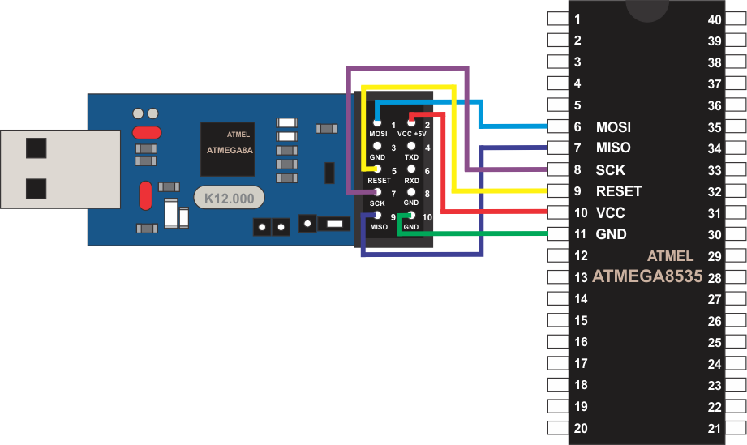

# Grabar ATmega8535 con USB programmer for Atmel AVR

Para poder grabar en distribuciones linux sólo se necesita 
instalar AVRdude.

**sudo add-apt-repository ppa:ubuntuhandbook1/apps**

**sudo apt-get update**

**sudo apt-get install avrdude avrdude-doc**

Para la plataformas de Windows leer: USBASP-UG.pdf

Una vez instalado AVRdude y precompilado el programa a grabar (*.hex)
es necesario conectar el microcontrolador y el programador como se
muestra en la figura.

 

Posteriormente en una consola de comandos ingresar:

avrdude -p **DEVICE** -P usb -c usbasp -U flash:w:**FILE**

Para ATmega8535

**DEVICE** m8535

**FILE** *.hex

Ejemplo:

avrdude -p m8535 -P usb -c usbasp -U flash:w:main.hex
